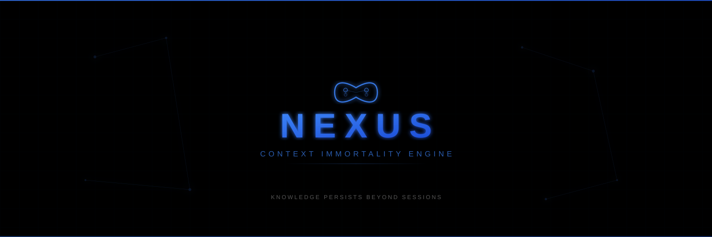
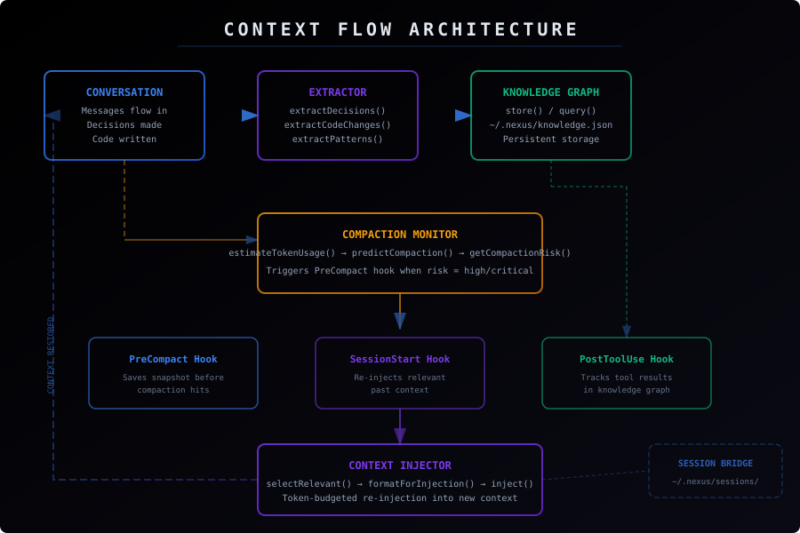
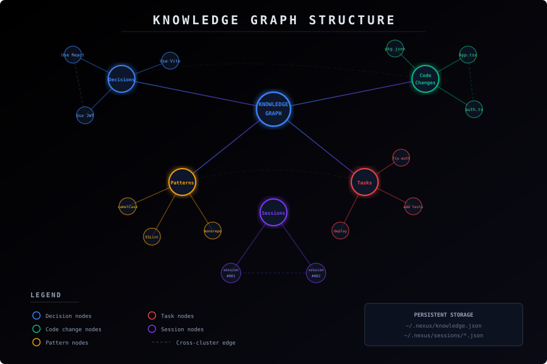

<p align="center">
  
</p>

<p align="center">
  <strong>Context Immortality Engine</strong><br/>
  <em>Knowledge graphs &middot; Compaction survival &middot; Cross-session memory</em>
</p>

<p align="center">
  
  
  
</p>

---

## The Problem

Every time Claude Code's context window compacts, you lose:
- Decisions made earlier in the conversation
- Knowledge of which files were changed and why
- Behavioral patterns you taught the assistant
- Task progress and pending work

When a session ends, **everything disappears**.

## The Solution

**Nexus** is a context persistence system that extracts, stores, and re-injects knowledge across compaction events and sessions. It gives Claude Code something it's never had: **memory that survives**.

## Architecture

<p align="center">
  
</p>

<p align="center">
  
</p>

## Core Modules

| Module | Purpose |
|--------|---------|
| `context-extractor.mjs` | Extracts decisions, code changes, patterns, and tasks from messages |
| `knowledge-graph.mjs` | Persistent key-value knowledge store with tags, relations, and pruning |
| `context-injector.mjs` | Selects relevant context and formats token-budgeted injections |
| `session-bridge.mjs` | Bridges context across separate sessions with search and merge |
| `compaction-monitor.mjs` | Estimates token usage, predicts compaction, and assesses risk |

## Hooks

| Hook | Event | Purpose |
|------|-------|---------|
| `nexus-precompact.py` | PreCompact | Saves a full context snapshot before compaction |
| `nexus-session-start.py` | SessionStart | Re-injects relevant past context into new sessions |
| `nexus-post-tool.py` | PostToolUse | Tracks file edits and commands in the knowledge graph |

## Quick Start

### 1. Clone

```bash
git clone https://github.com/pkmdev-sec/nexus.git ~/nexus
```

### 2. Configure Hooks

Add to your `~/.claude/settings.json`:

```json
{
  "hooks": {
    "PreCompact": [
      { "command": "python3 ~/nexus/hooks/nexus-precompact.py" }
    ],
    "SessionStart": [
      { "command": "python3 ~/nexus/hooks/nexus-session-start.py" }
    ],
    "PostToolUse": [
      { "command": "python3 ~/nexus/hooks/nexus-post-tool.py" }
    ]
  }
}
```

### 3. Run Tests

```bash
cd ~/nexus
npm test
```

## How It Works

### Before Compaction
1. The **Compaction Monitor** tracks token usage and detects when compaction is imminent
2. The **PreCompact Hook** fires, triggering the **Context Extractor**
3. Decisions, code changes, patterns, and tasks are extracted from messages
4. Everything is stored in the **Knowledge Graph** at `~/.nexus/knowledge.json`

### After Compaction / New Session
1. The **SessionStart Hook** fires
2. The **Context Injector** queries the Knowledge Graph for relevant entries
3. Entries are scored by relevance (Jaccard similarity) and recency
4. A token-budgeted payload is formatted and injected as context

### During the Session
1. The **PostToolUse Hook** monitors file edits and significant commands
2. Important tool results are continuously added to the Knowledge Graph
3. The knowledge base grows richer throughout the session

## Storage

All persistent data lives in `~/.nexus/`:

```
~/.nexus/
├── knowledge.json          # Main knowledge graph
├── sessions/               # Per-session summaries
│   ├── session-abc123.json
│   └── session-def456.json
├── snapshots/              # Pre-compaction snapshots
│   ├── snap-abc123.json
│   └── snap-def456.json
└── tool-log.jsonl          # Tool activity log
```

## API Reference

### Context Extractor

```javascript
import { extractDecisions, extractCodeChanges, extractPatterns, extractTasks, createSnapshot } from './lib/context-extractor.mjs';

const snapshot = createSnapshot(messages);
// → { id, ts, decisions, codeChanges, patterns, tasks, messageCount }
```

### Knowledge Graph

```javascript
import { store, query, getRelated, prune, exportGraph, importGraph } from './lib/knowledge-graph.mjs';

store('my-key', { data: 'value' }, { tags: ['important'], pinned: true });
const results = query('my-key');    // by key or tag
const related = getRelated('my-key'); // via relations
prune(7 * 24 * 60 * 60 * 1000);    // prune entries older than 1 week
```

### Context Injector

```javascript
import { selectRelevant, inject } from './lib/context-injector.mjs';

const relevant = selectRelevant('current task description', knowledgeEntries);
const { payload, included, estimatedTokens } = inject(relevant, 2000);
```

### Session Bridge

```javascript
import { saveSessionSummary, loadSessionSummary, findRelevantSessions, mergeContexts } from './lib/session-bridge.mjs';

saveSessionSummary('session-001', snapshot);
const past = findRelevantSessions('React');
const merged = mergeContexts(past);
```

### Compaction Monitor

```javascript
import { estimateTokenUsage, predictCompaction, getCompactionRisk } from './lib/compaction-monitor.mjs';

const risk = getCompactionRisk(messages); // → 'low' | 'medium' | 'high' | 'critical'
const prediction = predictCompaction(messages);
// → { currentTokens, limit, tokensRemaining, messagesUntilCompaction, percentUsed }
```

## License

MIT
