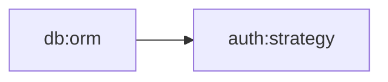

<p align="center">
  <strong>Context Immortality Engine</strong><br/>
  <em>Knowledge graphs &middot; Compaction survival &middot; Cross-session memory</em>
</p>

<p align="center">
  
  
  
</p>

---

## Why Nexus?

From Latin "nexus" meaning connection point, bond, or link. In Roman law, a nexus described an unbreakable obligation between parties. In network science, a nexus is the critical node where multiple pathways converge. NEXUS embodies this concept — it is the connection point between Claude Code contexts, the bond that links ephemeral sessions into persistent knowledge. When context compaction erases working memory, Nexus ensures that critical decisions, patterns, and knowledge remain connected across the void.

## The Problem

Every time Claude Code's context window compacts, you lose:
- Decisions made earlier in the conversation
- Knowledge of which files were changed and why
- Behavioral patterns you taught the assistant
- Task progress and pending work

When a session ends, **everything disappears**.

## The Solution

**Nexus** is a context persistence system that extracts, stores, and re-injects knowledge across compaction events and sessions. It gives Claude Code something it's never had: **memory that survives**.

## Architecture

<p align="center">
  
</p>

<p align="center">
  
</p>

## Core Modules

| Module | Purpose |
|--------|---------|
| `context-extractor.mjs` | Extracts decisions, code changes, patterns, and tasks from messages |
| `knowledge-graph.mjs` | Persistent key-value knowledge store with tags, relations, and pruning |
| `context-injector.mjs` | Selects relevant context and formats token-budgeted injections |
| `session-bridge.mjs` | Bridges context across separate sessions with search and merge |
| `compaction-monitor.mjs` | Estimates token usage, predicts compaction, and assesses risk |

## Hooks

| Hook | Event | Purpose |
|------|-------|---------|
| `nexus-precompact.py` | PreCompact | Saves a full context snapshot before compaction |
| `nexus-session-start.py` | SessionStart | Re-injects relevant past context into new sessions |
| `nexus-post-tool.py` | PostToolUse | Tracks file edits and commands in the knowledge graph |

## Quick Start

### 1. Clone

```bash
git clone https://github.com/pkmdev-sec/nexus.git ~/nexus
```

### 2. Configure Hooks

Add to your `~/.claude/settings.json`:

```json
{
  "hooks": {
    "PreCompact": [
      { "command": "python3 ~/nexus/hooks/nexus-precompact.py" }
    ],
    "SessionStart": [
      { "command": "python3 ~/nexus/hooks/nexus-session-start.py" }
    ],
    "PostToolUse": [
      { "command": "python3 ~/nexus/hooks/nexus-post-tool.py" }
    ]
  }
}
```

### 3. Run Tests

```bash
cd ~/nexus
npm test
```

## How It Works

### Before Compaction
1. The **Compaction Monitor** tracks token usage and detects when compaction is imminent
2. The **PreCompact Hook** fires, triggering the **Context Extractor**
3. Decisions, code changes, patterns, and tasks are extracted from messages
4. Everything is stored in the **Knowledge Graph** at `~/.nexus/knowledge.json`

### After Compaction / New Session
1. The **SessionStart Hook** fires
2. The **Context Injector** queries the Knowledge Graph for relevant entries
3. Entries are scored by relevance (Jaccard similarity) and recency
4. A token-budgeted payload is formatted and injected as context

### During the Session
1. The **PostToolUse Hook** monitors file edits and significant commands
2. Important tool results are continuously added to the Knowledge Graph
3. The knowledge base grows richer throughout the session

## Storage

All persistent data lives in `~/.nexus/`:

```
~/.nexus/
├── knowledge.json          # Main knowledge graph
├── sessions/               # Per-session summaries
│   ├── session-abc123.json
│   └── session-def456.json
├── snapshots/              # Pre-compaction snapshots
│   ├── snap-abc123.json
│   └── snap-def456.json
└── tool-log.jsonl          # Tool activity log
```

## Examples

Nexus includes practical examples demonstrating key workflows:

### Save Context Before Compaction

**[examples/save-context.mjs](examples/save-context.mjs)** - Demonstrates extracting and persisting decisions, code changes, patterns, and tasks from a conversation before compaction occurs.

```bash
node examples/save-context.mjs
```

This example shows how to:
- Detect compaction risk in real-time
- Extract decisions, code changes, patterns, and tasks from messages
- Store critical knowledge in the graph with appropriate tags
- Query and verify stored knowledge

### Cross-Session Memory

**[examples/cross-session.mjs](examples/cross-session.mjs)** - Demonstrates bridging context across separate Claude Code sessions by finding relevant past knowledge and re-injecting it.

```bash
node examples/cross-session.mjs
```

This example shows how to:
- Save session summaries with structured metadata
- Find relevant past sessions based on project/topic
- Merge context from multiple sessions
- Select and inject relevant knowledge within token budgets

## API Reference

### Context Extractor

```javascript
import { extractDecisions, extractCodeChanges, extractPatterns, extractTasks, createSnapshot } from './lib/context-extractor.mjs';

const snapshot = createSnapshot(messages);
// → { id, ts, decisions, codeChanges, patterns, tasks, messageCount }
```

### Knowledge Graph

```javascript
import { store, query, getRelated, prune, exportGraph, importGraph } from './lib/knowledge-graph.mjs';

store('my-key', { data: 'value' }, { tags: ['important'], pinned: true });
const results = query('my-key');    // by key or tag
const related = getRelated('my-key'); // via relations
prune(7 * 24 * 60 * 60 * 1000);    // prune entries older than 1 week
```

#### Path Finding

Find connections between concepts in the knowledge graph:

```javascript
import { findPathBFS, findPathDFS, findAllPaths, getPathDistance } from './lib/knowledge-graph.mjs';

// Find shortest path between two concepts
const path = findPathBFS('auth:jwt', 'db:users');  // → ['auth:jwt', 'api:auth', 'db:users']

// Find all paths (up to a limit)
const allPaths = findAllPaths('frontend:react', 'backend:api', 10);

// Get distance between concepts
const distance = getPathDistance('auth:jwt', 'db:users');  // → 2
```

### Context Injector

```javascript
import { selectRelevant, inject } from './lib/context-injector.mjs';

const relevant = selectRelevant('current task description', knowledgeEntries);
const { payload, included, estimatedTokens } = inject(relevant, 2000);
```

### Session Bridge

```javascript
import { saveSessionSummary, loadSessionSummary, findRelevantSessions, mergeContexts } from './lib/session-bridge.mjs';

saveSessionSummary('session-001', snapshot);
const past = findRelevantSessions('React');
const merged = mergeContexts(past);
```

### Compaction Monitor

```javascript
import { estimateTokenUsage, predictCompaction, getCompactionRisk } from './lib/compaction-monitor.mjs';

const risk = getCompactionRisk(messages); // → 'low' | 'medium' | 'high' | 'critical'
const prediction = predictCompaction(messages);
// → { currentTokens, limit, tokensRemaining, messagesUntilCompaction, percentUsed }
```

## Visualization

Nexus can export your knowledge graph for visualization in external tools:

### DOT Format (Graphviz)

Export to DOT format for rendering with Graphviz tools like `dot`, `neato`, or `circo`:

```javascript
import { exportDOT } from './lib/knowledge-graph.mjs';
import { writeFileSync } from 'fs';

// Export with default options (color-coded by recency)
const dot = exportDOT();
writeFileSync('knowledge-graph.dot', dot);

// Render with Graphviz
// $ dot -Tpng knowledge-graph.dot -o knowledge-graph.png
// $ neato -Tsvg knowledge-graph.dot -o knowledge-graph.svg
```

Options:
- `includeMetadata` (default: `true`) - Include node values in labels
- `layout` (default: `'dot'`) - Graphviz layout engine hint
- `colorByAge` (default: `true`) - Color nodes by recency:
  - Green: < 1 day old
  - Blue: < 7 days old
  - Gold: < 30 days old
  - Orange: > 30 days old

### Mermaid Format

Export to Mermaid diagram syntax for rendering in Markdown or documentation sites:

```javascript
import { exportMermaid } from './lib/knowledge-graph.mjs';

const mermaid = exportMermaid();
console.log(mermaid);
// Paste into GitHub/GitLab markdown or mermaid.live
```

Example output:


## Memory Management

Nexus provides tools to maintain a healthy knowledge graph and prevent unbounded growth:

### Graph Statistics

Get insights into your knowledge graph for maintenance decisions:

```javascript
import { getGraphStats } from './lib/knowledge-graph.mjs';

const stats = getGraphStats();
console.log(stats);
// {
//   totalNodes: 156,
//   pinnedCount: 23,
//   orphanCount: 12,      // nodes with no relations
//   staleCount: 8,         // older than 30 days
//   tagCounts: {
//     'decision': 15,
//     'pattern': 8,
//     'database': 12,
//     ...
//   }
// }
```

### Pruning Utilities

Remove old or unused nodes to keep the graph focused and performant:

```javascript
import { prune, pruneOrphans } from './lib/knowledge-graph.mjs';

// Remove nodes older than 30 days (respects pinned nodes)
const removed = prune(30 * 24 * 60 * 60 * 1000);
console.log(`Pruned ${removed} stale nodes`);

// Remove orphan nodes (no relations to other nodes)
const result = pruneOrphans({
  keepPinned: true,      // Keep pinned orphans (default: true)
  minAge: 7 * 86400000   // Only remove orphans older than 7 days (default: 0)
});
console.log(`Removed ${result.removed} orphans, ${result.remaining} nodes remain`);
```

**Best Practices:**
- Run `getGraphStats()` periodically to monitor graph health
- Prune stale nodes monthly: `prune(30 * 86400000)`
- Remove old orphans weekly: `pruneOrphans({ minAge: 7 * 86400000 })`
- Always pin critical decisions and architectural patterns
- Use tags to categorize nodes for targeted cleanup

## License

MIT
